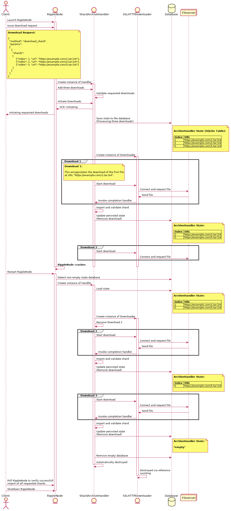

# Shard Downloader Improvements

## Overview

This document describes the changes being made to the `SSLHTTPDownloader`, a class that performs the task of downloading shards from remote web servers via
SSL HTTP. The downloader utilizes a strand (`boost::asio::io_service::strand`) to ensure that downloads are never executed concurrently. Hence, if a download is in progress when another download is initiated, the second download will be queued and invoked only when the first download is completed.

## New Features

- The ability to pause/resume downloads.
- The ability to resume downloads after a software crash.
- <span style="color:gray">*(Deferred) The ability to download from multiple servers to a single file.*</span>

## Classes

Implementing the shard downloader improvements will require making changes to the following classes:

- `SSLHTTPDownloader`

   This is a generic class designed for serially executing downloads via HTTP SSL.

- `ShardArchiveHandler`

   This class uses the `SSLHTTPDownloader` to fetch shards from remote web servers. Additionally, the archive handler performs sanity checks on the downloaded files and imports the validated files into the local shard store.

- `SQLiteBody`

   This is a new class that defines a custom message body type, allowing an `http::response_parser` to write to a SQLite database rather than to a flat file. This class is discussed in further detail in the Recovery section.

##### ShardArchiveHandler
The `ShardArchiveHandler` exposes a simple public interface:

```C++
/** Add an archive to be downloaded and imported.
    @param shardIndex the index of the shard to be imported.
    @param url the location of the archive.
    @return `true` if successfully added.
    @note Returns false if called while downloading.
*/
bool
add(std::uint32_t shardIndex, parsedURL&& url);

/** Starts downloading and importing archives. */
bool
start();
```

When a client submits a `download_shard` command via the RPC interface, each of the requested files is registered with the handler via the `add` method. After all the files have been registered, the handler's `start` method is invoked, which in turn creates an instance of the `SSLHTTPDownloader` and begins the first download. When the download is completed, the downloader invokes the handler's `complete` method, which will initiate the download of the next file, or simply return if there are no more downloads to process. When `complete` is invoked with no remaining files to be downloaded, the handler and downloader are destroyed automatically.

## Execution Concept

This section describes in greater detail how the new features will be
implemented in C++ using the `boost::asio` framework.

##### Member Variables:

The variables shown here are members of the `SSLHTTPDownloader` class and
will be used in the following code examples.

```c++
using boost::asio::ssl::stream;
using boost::asio::ip::tcp::socket;

stream<socket>>         stream_;
std::condition_variable pauseResume_;
std::atomic<bool>       isPaused_;
```

### Pausing Downloads

##### Thread 1:

A pause is initiated by setting an atomic member variable.

```c++
void SSLHTTPDownloader::pauseDownloads()
{
    isPaused_ = true;
}
```

##### Thread 2:

The pause is realized when the thread executing the download polls `isPaused_`  after this variable has been set to `true`. Polling only occurs while the file is being downloaded, in between calls to `async_read_some()`. The pause takes effect when the socket is closed and the thread sleeps on a condition variable. Any queued downloads will be postponed, as each download is invoked on the same `strand`.

```c++
void SSLHTTPDownloader::do_session()
{
    while (true)
    {
         // (Connection initialization logic)

         .
         .
         .

         // (In between calls to async_read_some):

         if (isPaused_.load ())
         {
             stream_->async_shutdown();
             pauseResume_.wait ();

             // After waking up, use "continue"
             // to start at the beginning of this
             // method. This will reconnect to the
             // server and resume the download.
             continue;
         }

         .
         .
         .

         break;
    }
}
```

### Resuming Downloads

##### Thread 1:

Resuming downloads is initiated by updating `isPaused_`, and waking any thread currently waiting on the condition variable `pauseResume_`. It's possible that no thread is waiting on `pauseResume_`, which is not an issue.

```c++
void SSLHTTPDownloader::resumeDownloads()
{
    if (!isPaused_.load ())
        return;

    isPaused_ = false;
    pauseResume_.notify_one ();
}
```

##### Thread 2:

In order to resume the download, the notified thread restarts the current routine. Rather than recursively invoking the current method, which could be abused to cause stack overflow, the routine is wrapped in a `while` loop, and the thread reconnects to the server by using `continue` to return to the beginning of the method.

```c++
void SSLHTTPDownloader::do_session()
{
    while (true)
    {
         // (Connection initialization logic)

         .
         .
         .

         if (downloadInterrupted)
         {
             // Request remainder of file using the
             // HTTP range header.
         }

         // (In between calls to async_read_some):

         if (isPaused_.load ())
         {
             stream_->async_shutdown();
             pauseResume_.wait ();

             // After waking up, use "continue"
             // to start at the beginning of this
             // method. This will reconnect to the
             // server and resume the download.
             continue;
         }

         .
         .
         .

         break;
    }
}
```

##### Note:
To resume downloading after a pause, as an alternative to using flow control, we could also refactor the connection and download initialization logic into a separate method that gets invoked at the beginning of `do_session()` and after waking. This is the preferred approach.

### Recovery

Persisting the current state of both the archive handler and the downloader is achieved by leveraging a SQLite database rather than flat files, as the database protects against data corruption that could result from a system crash.

##### ShardArchiveHandler

Although `SSLHTTPDownloader` is a generic class that could be used to download a variety of file types, currently it is used exclusively by the `ShardArchiveHandler` to download shards. In order to provide resilience, the `ShardArchiveHandler` will utilize a SQLite database to preserve its current state whenever there are active, paused, or queued downloads. The `shard_db` section in the configuration file allows users to specify the location of the database to use for this purpose.

###### SQLite Table Format

| Index | URL                                 |
|:-----:|:-----------------------------------:|
| 1     | ht<span>tps://example.com/1.tar.lz4 |
| 2     | ht<span>tps://example.com/2.tar.lz4 |
| 5     | ht<span>tps://example.com/5.tar.lz4 |

##### SSLHTTPDownloader

While the archive handler maintains a list of all partial and queued downloads, the `SSLHTTPDownloader` stores the raw bytes of the file currently being downloaded. The partially downloaded file will be represented as one or more `BLOB` entries in a SQLite database. As the maximum size of a `BLOB` entry is currently limited to roughly 2.1 GB, a 5 GB shard file for instance will occupy three database entries upon completion.

###### SQLite Table Format

Since downloads execute serially by design, the entries in this table always correspond to the content of a single file.

| Bytes  | Size       | Part |
|:------:|:----------:|:----:|
| 0x...  | 2147483647 | 0    |
| 0x...  | 2147483647 | 1    |
| 0x...  | 705032706  | 2    |

##### Config File Entry
The `download_path` field of the `shard_db` entry will be used to determine where to store the recovery database. If this field is omitted, the `path` field will be used instead.

```dosini
# This is the persistent datastore for shards. It is important for the health
# of the ripple network that rippled operators shard as much as practical.
# NuDB requires SSD storage. Helpful information can be found here
# https://ripple.com/build/history-sharding
[shard_db]
type=NuDB
path=/var/lib/rippled/db/shards/nudb
download_path=/var/lib/rippled/db/shards/
max_size_gb=50
```

##### Resuming Partial Downloads
When resuming downloads after a crash or other interruption, the `SSLHTTPDownloader` will utilize the `range` field of the HTTP header to download only the remainder of the partially downloaded file.

```C++
auto downloaded = getPartialFileSize();
auto total = getTotalFileSize();

http::request<http::file_body> req {http::verb::head,
  target,
  version};

if (downloaded < total)
{
  // If we already download 1000 bytes to the partial file,
  // the range header will look like:
  // Range: "bytes=1000-"
  req.set(http::field::range, "bytes=" + to_string(downloaded) + "-");
}
else if(downloaded == total)
{
  // Download is already complete. (Interruption Must
  // have occurred after file was downloaded but before
  // the state file was updated.)
}
else
{
  // The size of the partially downloaded file exceeds
  // the total download size. Error condition. Handle
  // appropriately.
}
```

##### SQLiteBody

Currently, the `SSLHTTPDownloader` leverages a `http::response_parser` instantiated with a `http::file_body`. The `file_body` class declares a nested type, `reader`, which does the task of writing HTTP message payloads (constituting a requested file) to the filesystem. In order for the `http::response_parser` to interface with the database, we implement a custom body type that declares a nested `reader` type which has been outfitted to persist octects received from the remote host to a local SQLite database. The code snippet below illustrates the customization points available to user-defined body types:

```C++
/// Defines a Body type
struct body
{
    /// This determines the return type of the `message::body` member function
    using value_type = ...;

    /// An optional function, returns the body's payload size (which may be zero)
    static
    std::uint64_t
    size(value_type const& v);

    /// The algorithm used for extracting buffers
    class reader;

    /// The algorithm used for inserting buffers
    class writer;
}

```

The method invoked to write data to the filesystem (or SQLite database in our case) has the following signature:

```C++
std::size_t
body::reader::put(ConstBufferSequence const& buffers, error_code& ec);
```

## Sequence Diagram

This sequence diagram demonstrates a scenario wherein the `ShardArchiveHandler` leverages the state persisted on the filesystem to recover from a crash and resume the scheduled downloads.


